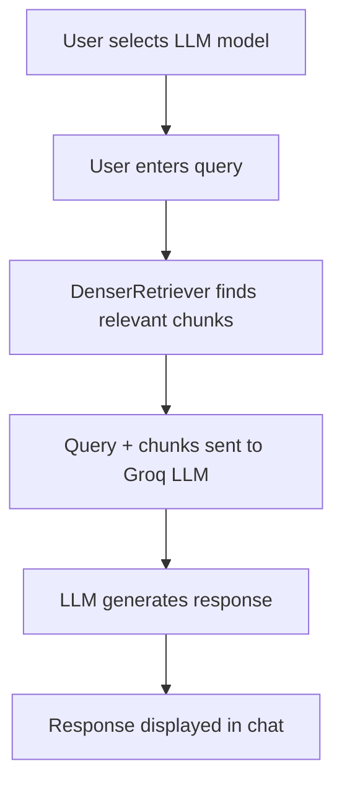

# Instructor Q&A: RAG-Powered Chatbot for Python Instructor Library

Instructor Q&A is a RAG (Retrieval-Augmented Generation) chatbot specifically designed to answer questions about the Python Instructor library. It leverages DenserRetriever for fetching relevant information from a knowledge base and utilizes Groq API for LLM models to generate accurate responses to user queries.

## Features

- Interactive chat interface built with Streamlit
- RAG-based question answering about the Python Instructor library
- Integration with DenserRetriever for efficient information retrieval
- Utilization of Groq LLM models for generating responses
- Exportable chat history
- Customizable LLM model selection

## Note

- Groq API is used as an example (they have super fast inference⚡), instructor supports both local and commercial models.
- This project uses `Q and A on the instructor library` as an example (as I was exploring the instructor library for structured data extraction and thought of creating a RAG chatbot for it, to solve my doubts), but can be adapted for any knowledge base by creating a retriever with the relevant docs.

## Installation

1. Clone the repository:
   ```
   git clone https://github.com/Prajwalsrinvas/denser-retriever-rag-chatbot
   cd instructor-rag-chatbot
   ```
   
2. Install the required dependencies:
   ```
   pip install -r requirements.txt
   ```

3. Set up the environment variables:
   - Create a `.env` file in the root directory with the following content:
     ```
     GROQ_API_KEY=your_groq_api_key
     DENSER_RETRIEVER_API_KEY=your_denser_retriever_api_key
     RETRIEVER_ID=your_retriever_id
     ```
   - Create a `secrets.toml` file in the `.streamlit` directory with the following content:
     ```
     GROQ_API_KEY = "your_groq_api_key"
     DENSER_RETRIEVER_API_KEY = "your_denser_retriever_api_key"
     RETRIEVER_ID = "your_retriever_id"
     ```

4. Fetch the available Groq models:
   ```
   python fetch_groq_models.py
   ```

## Usage

1. Start the Streamlit app:
   ```
   streamlit run app.py
   ```

2. Open your web browser and navigate to the URL provided by Streamlit (usually `http://localhost:8501`).

3. Use the sidebar to select a Groq LLM model.

4. Enter your questions about the Python Instructor library in the chat input.

5. View the AI's responses and the retrieved context.

6. Optionally, export the chat history or clear it using the buttons in the sidebar.

## How It Works

Instructor Q&A utilizes a RAG approach to provide accurate answers about the Python Instructor library. Here's a high-level overview of the process:

1. The user selects an LLM model from the available Groq models.
2. The user enters a query about the Instructor library.
3. The DenserRetriever API is called to find relevant chunks of information from the knowledge base.
4. The retrieved chunks and the user's query are sent to the selected Groq LLM model.
5. The LLM generates a response based on the provided context and query.
6. The response is displayed in the chat interface, along with the option to view the retrieved context.



## Configuration

### Groq API
- The Groq API key is required for accessing the LLM models.
- Set the `GROQ_API_KEY` in both the `.env` file and the `secrets.toml` file.

### DenserRetriever
- The DenserRetriever API key and Retriever ID are required for fetching relevant information.
- Set the `DENSER_RETRIEVER_API_KEY` and `RETRIEVER_ID` in both the `.env` file and the `secrets.toml` file.

### Streamlit
- Streamlit-specific configurations can be adjusted in the `streamlit/config.toml` file if needed.
